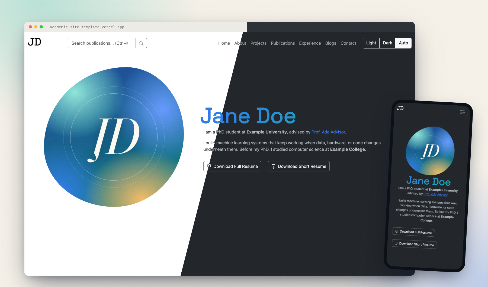

<!-- personal-only:start -->
> **This repository is the source of [kunpai.space](https://www.kunpai.space).**
> To build your own site from it, start from the template instead:
> **[kunpai/academic-site-template](https://github.com/kunpai/academic-site-template)**. It is generated from
> this repo automatically, with the example content in place of mine
> ([live demo](https://academic-site-template.vercel.app)).

<!-- personal-only:end -->
# Academic Site Template

A personal website for researchers, PhD students and academics: publications with a topic graph,
a blog, a CV/resume built from the same data, and a site that search engines and LLMs can read.
Built with Next.js 13, React and Bootstrap. All your content lives in one folder, `content/`, so
you can take updates to the site code without merge conflicts.

[](https://github.com/kunpai/academic-site-template/generate)
[](https://vercel.com/new/clone?repository-url=https%3A%2F%2Fgithub.com%2Fkunpai%2Facademic-site-template)
[](https://academic-site-template.vercel.app)

[](https://academic-site-template.vercel.app)

The demo at [academic-site-template.vercel.app](https://academic-site-template.vercel.app) is
built from this repository with the example content for the fictional Jane Doe.

## Features

- **Everything personal lives in `content/`**: config, data (JSON), about page, blog posts.
  Photos and PDFs go in `public/`.
- **Sections you can switch off.** Turning off `projects`, `blogs` and so on removes the page (it
  returns 404), its nav link, its homepage block, and its entries in the sitemap, RSS and
  `llms.txt`.
- **Publications** with tabs by type, a topic graph built from your tags, BibTeX, and your name
  highlighted in author lists.
- **Blog** in Markdown (GitHub-flavoured, raw HTML allowed), with reading time and an RSS feed.
- **CV and resume PDFs** generated with LaTeX from the same data. A GitHub Action rebuilds them
  when you push.
- **Readable by search engines and LLMs:** JSON-LD, a sitemap, and `llms.txt` / `llms-full.txt`.
- **Checked content:** JSON Schemas give editor autocomplete, and `npm run validate` runs before
  every build.
- Light and dark mode, a configurable accent colour and heading font.
- Optional link pages for posters and talks (`linktree`, off by default).

## Compared to al-folio and academicpages

[al-folio](https://github.com/alshedivat/al-folio) and
[academicpages](https://github.com/academicpages/academicpages.github.io) are the most popular
academic site templates, and both are mature and free to host on GitHub Pages. This template
makes different trade-offs:

| | This template | al-folio | academicpages |
|---|---|---|---|
| **Stack** | Next.js 13 (React), Node | Jekyll (Ruby) | Jekyll (Ruby), based on Minimal Mistakes |
| **Your content** | One folder, `content/`, checked against JSON Schemas | Spread across `_pages/`, `_posts/`, `_bibliography/`, `_config.yml` | Spread across `_pages/`, `_publications/`, `_talks/`, `_config.yml` |
| **Updating** | `npm run update` merges the new template; only site code changes, so your content never conflicts | Merge upstream; files you customised can conflict | Fork; no separate update path |
| **Publications** | JSON with a BibTeX entry each, plus an interactive topic graph | A BibTeX file, rendered with jekyll-scholar | One Markdown file per paper (scripts can generate them from TSV/BibTeX) |
| **CV** | CV and short resume compiled to PDF with LaTeX from the same data, locally or by a GitHub Action | CV page from JSON Resume or YAML; you supply the PDF | CV page in Markdown; you supply the PDF |
| **Deploy target** | Vercel (or any Next.js host) | GitHub Pages | GitHub Pages |

Choose al-folio or academicpages if you want GitHub Pages hosting, Jekyll, or their larger
ecosystems of themes and features. Choose this one if you'd rather work in React, keep your
content cleanly separated, and have your CV PDF built from the same data as the site.

## Quickstart

1. Click **Use this template** on GitHub (or clone the repo), then:
   ```bash
   npm install
   npm run setup     # creates content/ from examples/ and asks for your name, links, sections
   npm run dev       # http://localhost:3000
   ```
2. Replace the example entries in `content/data/*.json` with yours. See
   [docs/CONTENT.md](docs/CONTENT.md) for every field.
3. Deploy: import the repository in [Vercel](https://vercel.com). The default Next.js settings
   work as they are.

Until `content/` exists, `npm run dev` and `npm run build` use the example site in `examples/`.
So a fresh clone, or the Deploy button above, shows a working demo straight away.

## What lives where

| Path | What it is |
|---|---|
| `content/config.json` | Name, links, SEO, feature flags, theme, UI labels |
| `content/data/*.json` | Publications, education, experience, projects, skills, awards, news, talks, service |
| `content/about.md` | The About page |
| `content/blogs/*.md` | Blog posts (front matter: `title`, `date`, `tags`, `authors`, `image`) |
| `public/` | Your photo, images, and CV/resume PDFs, served as-is |
| `examples/` | The starter content that `npm run setup` copies |
| `schemas/` | JSON Schemas for everything in `content/` |
| `components/`, `pages/`, `lib/`, `styles/`, `scripts/` | Site code |

Your editor (VS Code, via `.vscode/settings.json`) autocompletes and checks `content/` files
against `schemas/`.

## Customising

**Sections.** Set `features.<name>` to `false` in `content/config.json`:

```json
"features": { "projects": false, "blogs": true, "talks": false }
```

All sections are on by default except `linktree`. The full table is in
[docs/CONTENT.md](docs/CONTENT.md#feature-flags).

**Look.** Pick any Google Fonts family for headings, and optionally an accent colour:

```json
"theme": { "headingFont": "Audiowide", "accentColor": "#0d6efd", "gradientStart": "#0d6efd", "gradientEnd": "#00d2ff" }
```

Without colours the site uses Bootstrap's default palette. Setting `gradientStart` and
`gradientEnd` adds a gradient to your name in the hero.

**Wording.** Button and heading text can be overridden under `labels`, for example
`"labels": { "resumeButton": "Download CV" }`.

**Homepage.** Work and project entries appear on the homepage unless they set
`"show_on_homepage": false`. The full pages always list everything.

## CV and resume

```bash
python3 scripts/generate_resumes.py   # needs a LaTeX install (MacTeX, TeX Live)
```

This writes the PDFs named by `resume` and `resume_short` in your config into `public/`. Entries
opt in or out with `show_in_resume` and `show_in_resume_short`. On GitHub, the **Build Resumes**
workflow does the same on every push that changes `content/`.

## Scripts

| Command | What it does |
|---|---|
| `npm run setup` | First-time setup and identity wizard |
| `npm run dev` | Development server (regenerates `llms.txt` and RSS first) |
| `npm run validate` | Check `content/` against the schemas |
| `npm run build` | Validate, generate `llms.txt`/RSS, build, write the sitemap |
| `npm run update` | Merge the latest template into your site ([details](#getting-updates)) |
| `npm run indexnow` | After a deploy, tell Bing and others about your pages |

**Environment variables:** none are required. `SITE_URL` optionally overrides `siteUrl` for the
sitemap.

## Getting updates

Your content lives in `content/` and `public/`, and template updates only touch site code. To
pull the latest version, commit your work and run:

```bash
npm run update
```

This fetches the template and merges it. You only get conflicts in site files you edited yourself
(say, a component you customised), never in your content.

Why a script: **Use this template** gives your repository fresh history with no commit in common
with the template, so a plain `git merge` would conflict on every file the template changed. Each
release carries a `.template-version` stamp. On the first update, the script uses it to find the
version you started from and links the two histories, so later merges are ordinary merges.

## Show your site

Built something with this template? Share it in the
[Show your site](https://github.com/kunpai/academic-site-template/discussions/1) discussion.
Questions go in [Discussions](https://github.com/kunpai/academic-site-template/discussions), and bugs in
[Issues](https://github.com/kunpai/academic-site-template/issues).

## License

The code is under the [MIT License](LICENSE). The example content in `examples/` is yours to
replace.
